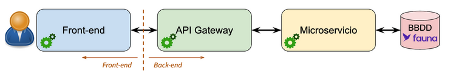
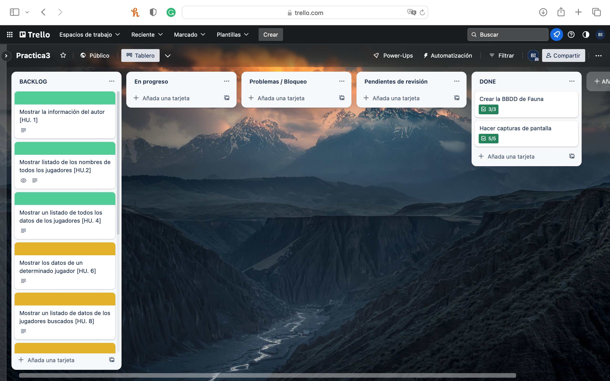
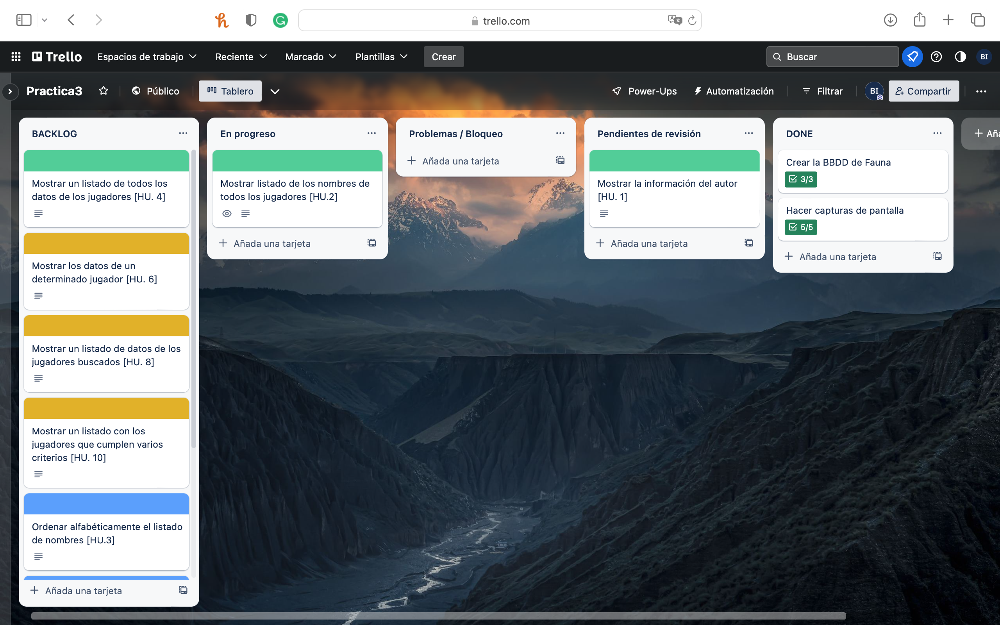
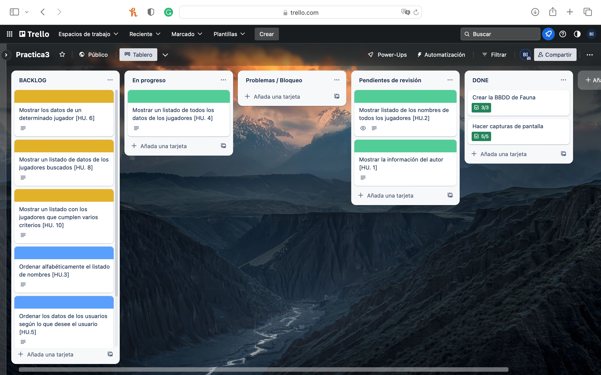
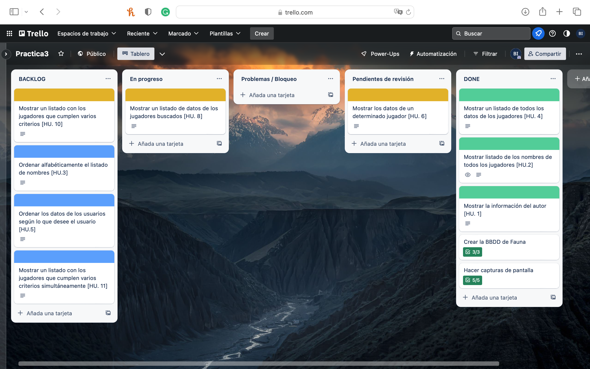
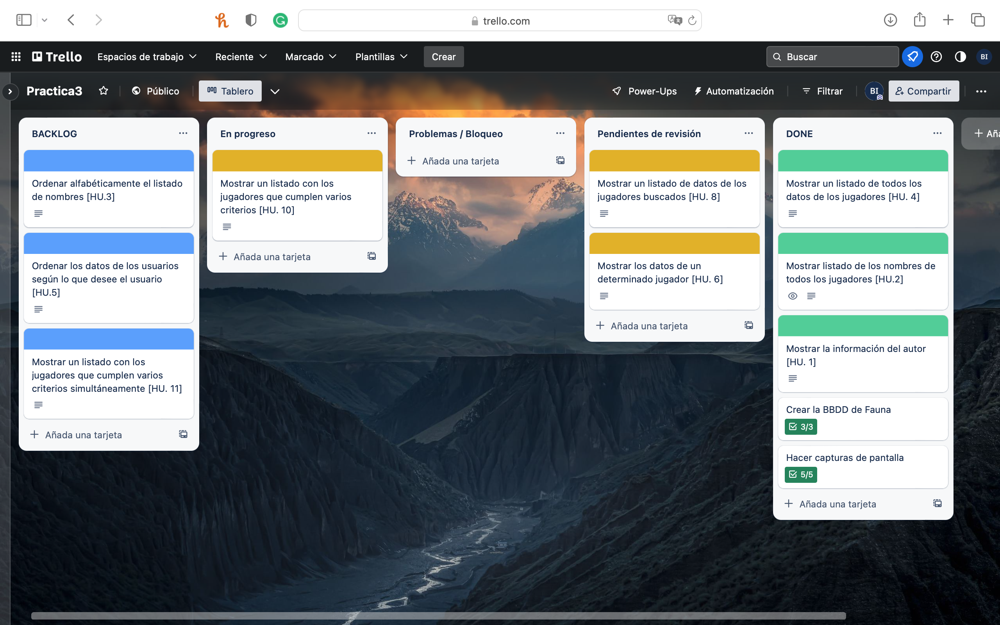
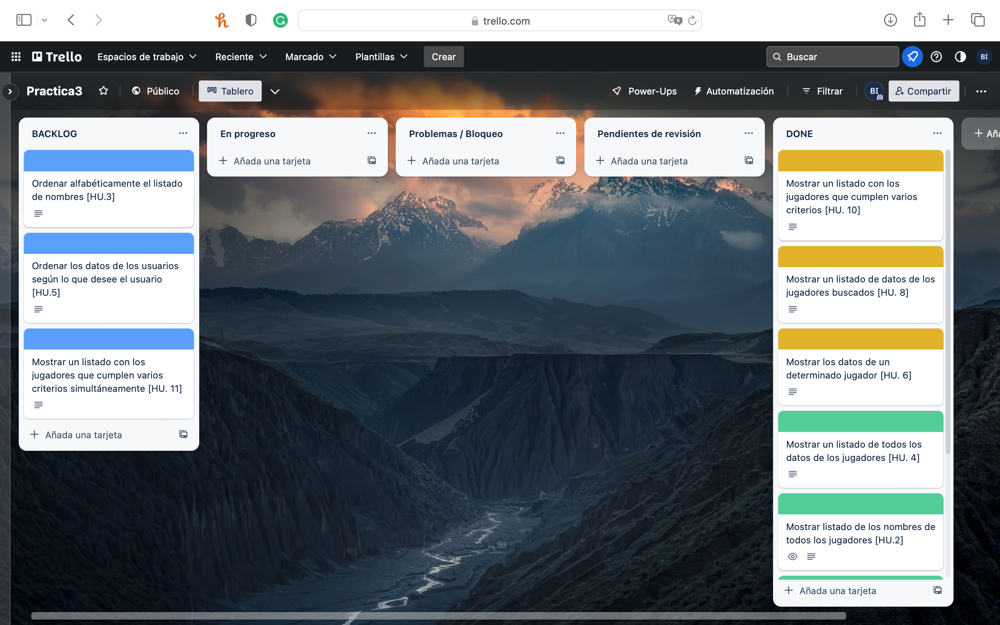
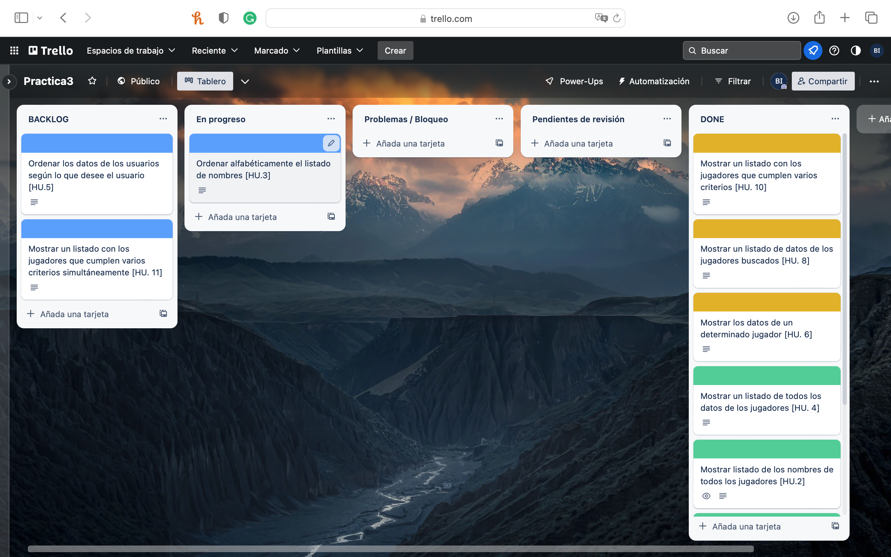

[](https://classroom.github.com/online_ide?assignment_repo_id=10405612&assignment_repo_type=AssignmentRepo)
# *Plantilla Práctica Microservicios*: descripción de la aplicación

Este código que se presenta aquí corresponde a la plantilla para realizar un desarrollo basado en microservicios para las prácticas de Desarrollo Ágil, para el curso 2022-2023.


## Arquitectura de la aplicación

La aplicación funciona gracias a la colaboración de **tres aplicaciones distintas** (en realidad, tres servidores web implementados con [Express ↗️](https://expressjs.com/) para [Node.js ↗️](https://nodejs.org/en/)).

 

*Esquema de comunicación entre las distintas aplicaciones.* &#8593;

Como se puede observar, esta aplicación plantilla está formada por las siguientes aplicaciones web:
* Aplicación *front-end*: servidor para la página web
* Aplicación *api-gateway*: enrutador de peticiones a microservicios
* Aplicación *ms-plantilla*: microservicio

Se respetan siempre las siguientes reglas básicas:
1. El usuario solo interactúa con la aplicación *front-end*
2. La aplicación *front-end* solo interactúa con la aplicación *api-gateway*
3. La aplicación *api-gateway* recibe peticiones de *front-end* y las deriva al microservicio correspondiente. Dicho microservicio resuelve la petición y envía el resultado a la aplicación *front-end* a través de *api-gateway*
4. Los microservicios interactúan con una BBDD y con *api-gateway* y también entre ellos. 
5. En el caso de haber varios microservicios, cada uno de ellos puede interactuar con una BBDD distinta. Además, los microservicios pueden interactuar directamente entre ellos.
   
## Funcionamiento de la aplicación
La funcionalidad implementada en la plantilla es muy simple: hay dos botones que llaman, respectivamente, a la ruta raíz del microservicio (es decir, ```/plantilla/```) y a la ruta "Acerca de" (```/plantilla/acercade```) siempre usando como intermediario a la aplicación *api-gateway*.

Las siguientes imágenes muestran la interfaz de la aplicación una vez puesta en marcha:


*Pantalla de inicio de la aplicación al pulsar en el botón **Home*** &#8593;


*Pantalla de inicio de la aplicación al pulsar en el botón **Acerca de*** &#8593;


*Pantalla de inicio de la aplicación cuando se está ejecutando con Jasmine para comprobación de TDD* &#8593;

## Puesta en marcha de de la aplicación: ```npm install```

Para facilitar la descarga del código como ejercicio de *Clasroom GitHub*, se han introducido las tres aplicaciones en un solo repositorio. En un proyecto real, tendríamos repositorios distintos para cada una de las aplicaciones.

Para poder poner en marcha el proyecto, debemos clonar el repositorio y, posteriormente, abrir un terminal de línea de órdenes e ir entrando en cada uno de los tres directorios que existen (es decir: ```front-end```, ```ms-plantilla``` y ```api-gateway```) escribiendo la siguiente instrucción en cada uno de ellos:

```
npm install
```

Para comprobar que la instalación ha funcionado correctamente, podemos ejecutar en cada uno de los directorios la siguiente instrucción:

```
npm test
```

Si el resultado es que se han ejecutado los tests (aunque sea con error), es que el proceso de instalación ha sido correcto y podemos pasar a ejecutar la aplicación.
## Ejecución de la aplicación: ```npm start```

Para poder disfrutar de toda la funcionalidad de la aplicación, necesitamos ejecutar **simultáneamente** las tres aplicaciones. Para ello, lo más adecuado es abrir tres consolas de línea de comandos distinas. En cada una de ellas, tendremos que meternos en un directorio correspondiente a una aplicación y posteriormene ejecutar:

```
npm start
```

El resultado debería ser muy similar a este:

**Consola de front-end:**
```
front-end % npm start

> front-end@1.0.0 start
> node server.js

Aplicación Front-End escuchando en puerto 8000!
```

**Consola de api-gateway:**
```
fapi-gateway % npm start

> api-gateway@1.0.0 start
> node server.js

[HPM] Proxy created: /  -> http://localhost:8002
[HPM] Proxy rewrite rule created: "^/plantilla" ~> ""
```

**Consola de ms-plantilla:**
```
ms-plantilla % npm start

> ms-plantilla@1.0.0 start
> node server.js

Microservicio PLANTILLA ejecutándose en puerto 8002!
```

Una vez inicializadas las 3 aplicaciones, debemos poder abrir un navegador web y solicitar que nos muestre la URL: http://localhost:8000 ↗️. Debería en ese momento cargarse la página web mostrando la siguiente imagen.


*Pantalla de inicio de la aplicación en la primera ejecución* &#8593;

Para ejecutar la aplicación **SIN COMPROBACIÓN EN EL NAVEGADOR** de TDD, tendríamos que comentar (o eliminar) las siguientes líneas del fichero **index.html**:

**En la parte superior del fichero *index.html***:
```
    <link rel="stylesheet" href="lib/jasmine-4.5.0/jasmine.css">
    <script src="lib/jasmine-4.5.0/jasmine.js"></script>
    <script src="lib/jasmine-4.5.0/jasmine-html.js"></script>
    <script src="lib/jasmine-4.5.0/boot0.js"></script>
    <script src="lib/jasmine-4.5.0/boot1.js"></script>
```

**En la parte inferior del fichero *index.html***:
```
    <script src="js/front-end-spec.js"></script>
    <script src="js/ms-plantilla-spec.js"></script>
```

Hay que tener en cuenta que NO ES un fichero JavaScript, sino que es un fichero HTML; por tanto, para comentar esas líneas hay que usar: ```<!--``` y ```-->```.
## Organización del árbol de directorios de cada app

Las tres apps que forman el sistema completo tienen su código por separado y no comparten nada de dicho código.

No obstante, *ms-plantilla* y *front-end* tienen un conjunto de directorios y de ficheros con nombres idénticos (aunque con contenidos distintos). Solo la app *api-gateway* es un poco distinta, por el hecho de que se limita a redireccionar las llamadas que le llegan enviándolas al microservicio correspondiente.


*Estructura de directorios y ficheros de las aplicaciones* &#8593;


Describimos brevemente los ficheros y directorios que se encuentran en estas apps:
* ```server.js```: fichero en el que se declara el objeto ```app```, el cual hace las veces de servidor web; es decir, recibe llamadas a través del protocolo *http* y devuelve un resultado que puede ser en JSON o como fichero HTML (este formato solo lo devuelve la app *front-end*). Las tres aplicaciones desarrolladas utilizan la biblioteca [Express ↗️](https://expressjs.com/) para [Node.js ↗️](https://nodejs.org/en/).
* ```routes.js```: fichero en el que se declaran las rutas que se van a atender dentro de la llamada *http* que se está realizando. En la aplicación *api-gateway* este fichero cambia su nombre a ```proxy-routes.js```.
* ```callbacks.js```: fichero en el que se encuentran las funciones con las que se va a procesar la llamada a cada una de las rutas definidas en *routes.js*. El fichero ```calbacks.js``` **no existe** en la aplicación *api-gateway* dado que no es necesario que esta aplicación genere ni procese resultados; solamente reenvía lo que recibe hacia y desde el *fron-end* hacia los microservicios.
* ```spec```: directorio en el que se encuentran las pruebas a realizar con el entorno [Jasmine ↗️](https://jasmine.github.io/), para realizar TDD con JavaScript.
* ```package.json```: fichero con la configuración de cada app, necesario para que *npm* pueda ejecutar el proyecto.


Pasemos a ver alguno de estos ficheros con algo más de detalle.

### Fichero ```server.js```

El fichero ```server.js``` es el que permite ejecutar el servidor web en cada aplicación. En realidad, apenas se compone de unas líneas para configurar el servidor ([Express ↗️](https://expressjs.com/)) y dejarlo escuchando en el puerto seleccionado:

```
/**
 * @file server.js
 * @description Define el servidor que aceptará las peticiones para esta aplicación.
 * @author Víctor M. Rivas <vrivas@ujaen.es>
 * @date 03-feb-2023
 */
const express = require("express")
const app = express()

// Necesario para poder obtener los datos en las llamadas POST
const bodyParser = require("body-parser")
app.use(bodyParser.json())
app.use(bodyParser.urlencoded({ extended: false }))

// Necesario para gestionar el conjunto de callbacks para las distintas funciones REST
const routes = require("./routes")
app.use("/", routes);


const port = 8002;
app.listen(port, () => {
    console.log(`Microservicio PLANTILLA ejecutándose en puerto ${port}!`);
});


module.exports = app
```
*Ejemplo de fichero ```server.js``` del microservicio Plantilla*

Hay que tener en cuenta que en la aplicación *api-gateway* este fichero NO EXISTE, y en su lugar se define un objeto *proxy* que redirige las llamadas a los distintos microservicios. 

### Fichero ```routes.js```

Como se observa en el fichero ```server.js```, el servidor hace uso del módulo *routes* el cual define las rutas (paths, URLs) a los que nuestro servidor va a responder.

En el caso de la aplicación *api-gateway* este fichero ```routes.js``` no existe, y en su lugar se utiliza un fichero ```proxy-routes.js``` en el que se indican las reglas que debe seguir el *proxy* para redirigir las llamadas que le llegan.

```
/**
 * @file routes.js
 * @description Define las rutas ante las que va a responder al MS Plantilla
 * @author Víctor M. Rivas <vrivas@ujaen.es>
 * @date 03-feb-2023
 */

const express = require("express");
const router = express.Router();
const { callbacks } = require("./callbacks");


/**
 * Ruta raíz: /
 */
router.get("/", async (req, res) => {
    try {
        await callbacks.home(req, res)
    } catch (error) {
        console.log(error);
    }
});

/**
 * Ruta Acerca De (es decir, About...)
 */
router.get("/acercade", async (req, res) => {
    try {
        await callbacks.acercaDe(req, res)
    } catch (error) {
        console.log(error);
    }
});


/**
 * Test de conexión a la BBDD
 */
router.get("/test_db", async (req, res) => {
    try {
        await callbacks.test_db(req, res)
    } catch (error) {
        console.log(error);
    }
});


// Exporto el módulo para poder usarlo en server
module.exports = router;

```
*Ejemplo del fichero ```routes.js``` del microservicio Plantilla*

Como se observa en el ejemplo, este fichero ```routes.js``` define todas las rutas que se van a poder procesar y delega en un método del objeto *callbacks* el conjunto de acciones a realizar. El objeto *callbacks* es por tanto fundamental para que se ejecuta realmente la funcionalidad que el usuario espera.

### Fichero ```callbacks.js```

Finalmente, el fichero ```callbacks.js``` define un objeto importantísimo dado que contiene las constantes y métodos que se van a usar para resolver las llamadas que el usuario está realizando a través de las conexiones que realiza mediante su navegador de páginas web.

Estos métodos son precisamente los encargados de conectar con la base de datos, por lo que son los que permiten recuperar y almacenar datos en la misma.

```
//**
 * @file callbacks.js
 * @description Callbacks para el MS Plantilla.
 * Los callbacks son las funciones que se llaman cada vez que se recibe una petición a través de la API.
 * Las peticiones se reciben en las rutas definidas en routes.js, pero se procesan aquí.
 * @author Víctor M. Rivas <vrivas@ujaen.es>
 * @date 03-feb-2023
 */


// Necesario para conectar a la BBDD faunadb
const faunadb = require('faunadb'),
    q = faunadb.query;

const client = new faunadb.Client({
    secret: '¿¿¿ CLAVE SECRETA EN FAUNA PARA ESTA BBDD???',
});

const COLLECTION = "¿¿¿ COLECCION ???"

// CALLBACKS DEL MODELO

/**
 * Función que permite servir llamadas sin importar el origen:
 * CORS significa Cross-Origin Resource Sharing
 * Dado un objeto de tipo respuesta, le añade las cabeceras necesarias para realizar CROS
 * @param {*} res Objeto de tipo response 
 * @returns Devuelve el mismo objeto para concatenar varias llamadas al mismo
 */
function CORS(res) {
    res.header('Access-Control-Allow-Origin', '*')
        .header(
            'Access-Control-Allow-Headers',
            'Origin, X-Requested-With, Content-Type, Accept'
        )
    return res;
}


/**
 * Objeto que contiene las funciones callback para interactuar con el modelo (e.d., la BBDD)
 */
const CB_MODEL_SELECTS = {
    /**
     * Prueba de conexión a la BBDD: devuelve todas las personas que haya en la BBDD.
     * @param {*} req Objeto con los parámetros que se han pasado en la llamada a esta URL 
     * @param {*} res Objeto Response con las respuesta que se va a dar a la petición recibida
     */
    test_db: async (req, res) => {
        try {
            let personas = await client.query(
                q.Map(
                    q.Paginate(q.Documents(q.Collection(COLLECTION))),
                    q.Lambda("X", q.Get(q.Var("X")))
                )
            )
            res.status(200).json(personas)
        } catch (error) {
            res.status(500).json({ error: error.description })
        }
    },

}


// CALLBACKS ADICIONALES

/**
 * Callbacks adicionales. Fundamentalmente para comprobar que el ms funciona.
 */
const CB_OTHERS = {
    /**
     * Devuelve un mensaje indicando que se ha accedido a la home del microservicio
     * @param {*} req Objeto con los parámetros que se han pasado en la llamada a esta URL 
     * @param {*} res Objeto Response con las respuesta que se va a dar a la petición recibida
     */
    home: async (req, res) => {
        try {
            CORS(res).status(200).json({ mensaje: "Microservicio MS Plantilla: home" });
        } catch (error) {
            CORS(res).status(500).json({ error: error.description })
        }
    },

    /**
     * Devuelve un mensaje indicando que se ha accedido a la información Acerca De del microservicio
     * @param {*} req Objeto con los parámetros que se han pasado en la llamada a esta URL 
     * @param {*} res Objeto Response con las respuesta que se va a dar a la petición recibida
     */
    acercaDe: async (req, res) => {
        try {
            CORS(res).status(200).json({
                mensaje: "Microservicio MS Plantilla: acerca de",
                autor: "¿¿¿ AUTOR ???",
                email: "¿¿¿ EMAIL ???",
                fecha: "¿¿¿ FECHA ???"
            });
        } catch (error) {
            CORS(res).status(500).json({ error: error.description })
        }
    },

}

// Une todos los callbacks en un solo objeto para poder exportarlos.
// MUY IMPORTANTE: No debe haber callbacks con el mismo nombre en los distintos objetos, porque si no
//                 el último que haya SOBREESCRIBE a todos los anteriores.
exports.callbacks = { ...CB_MODEL_SELECTS, ...CB_OTHERS }

```

*Ejemplo de fichero ```callbacks.js``` del microservicio Plantilla*

**Es muy importante** notar que todos los métodos definidos en *callbacks* devuelven única y exclusivamente JSON. Los datos así devueltos se envían a la aplicación *front-end* que es la que tiene que procesarlos para mostrarlos al cliente.

### Las palabras reservadas *async* y *await*

Como se puede observar tanto en los *callbacks* como en *routes*, la inmensa mayoría de los métodos están definidos usando las palabras reservadas *async* y *await*:

```
// Dentro del fichero routes.js
// =============================

/**
 * Ruta raíz: /
 */
router.get("/", async (req, res) => {
    try {
        await callbacks.home(req, res)
    } catch (error) {
        console.log(error);
    }
});


----------------------------------------------

// Dentro del fichero callbacks.js
// ===============================

/**
     * Devuelve un mensaje indicando que se ha accedido a la información Acerca De del microservicio
     * @param {*} req Objeto con los parámetros que se han pasado en la llamada a esta URL 
     * @param {*} res Objeto Response con las respuesta que se va a dar a la petición recibida
     */
    acercaDe: async (req, res) => {
        try {
            CORS(res).status(200).json({
                mensaje: "Microservicio MS Plantilla: acerca de",
                autor: "¿¿¿ AUTOR ???",
                email: "¿¿¿ EMAIL ???",
                fecha: "¿¿¿ FECHA ???"
            });
        } catch (error) {
            CORS(res).status(500).json({ error: error.description })
        }
    },

```

Ambas palabras reservadas permiten trabajar mucho más cómodamente con "promesas" ([promise ↗️](https://developer.mozilla.org/en-US/docs/Web/JavaScript/Reference/Global_Objects/Promise)). Una promesa se define como:
> Una promesa es un objeto que representa la *eventual* resolución (con éxito o no) de una operación asíncrona, así como el valor devuelto por dicha operación.

En esencia, una promesa es una operación que se lanza y que NO detiene la ejecución del programa, pero que se queda "escuchando" hasta que recibe una respuesta. Normalmente se utilizan para solicitar datos a servicios remotos, de modo que la promesa lanza la llamada y, cuando llega el resultado, lo procesa. Mientras tanto, la aplicación sigue recibiendo peticiones y contestando a las mismas.

La utilización de *async* y *await* facilita enormemente la programación con promesas, dando al programador/a la sensación de que su código es secuencial (mucho más fácil de escribir), aunque en realidad está lanzando procesos asíncronos en paralelo.

*Lo más reseñable* del uso de estas dos palabras reservadas es que: **el operador _await_ solo puede usarse dentro de funciones o métodos que hayan sido declarados como _async_**.

Para profundizar más en la programación con promesas pueden usarse los siguientes enlaces:
* [JavaScript Asíncrono](https://developer.mozilla.org/es/docs/Learn/JavaScript/Asynchronous) ↗️
* [async and await](https://developer.mozilla.org/en-US/docs/Learn/JavaScript/Asynchronous/Promises#async_and_await) ↗️

## Aplicación de ejemplo de la que obtener código
Finalmente, para la implementación de la funcionalidad requerida en la práctica, se puede hacer uso del código disponible en el siguiente repositorio: 

https://github.com/UJA-Desarrollo-Agil/descripcion-proyecto-microservicios-personas-proyectos ↗️

El código en ese repositorio muestra una aplicación similar, pero con mucha más funcionalidad que esta plantilla: acceso a base de datos remota, listado de documentos recuperados de la BBDD, peticiones entre distintos microservicios, etc.

Además, incluye documentación sobre dicho código y un vídeo descriptivo de cómo se ha realizado y cómo funciona la aplicación de ejemplo.

# Resolución de la práctica
**Datos personales del alumno:**
* **Nombre:** Bader Irheem
* **Correo electronico:** bsi00001@red.ujaen.es

**Enlace al tablero Trello:** https://trello.com/b/uZPYPrJI/practica3

## Capturas de pantalla
Contenido del tablero Trello y la base de datos de Fauna antes de empezar los incrementos


*Captura de pantalla del Home de Fauna* &#8593;


*Captura de pantalla de la página en la que aparece la base de datos* &#8593;


*Captura de pantalla de la página en la que aparece la colección* &#8593;

## Contenido de los documentos 

### **El primero documento**
```
{
  nombre_completo: {
    nombre: "Bader",
    apellidos: "Irheem"
  },
  fecha_nacimiento: {
    dia: 17,
    mes: 8,
    año: 2000
  },
  direccion: {
    calle: "Calle San Antonio",
    localidad: "Jaén",
    provincia: "Jaén",
    pais: "España"
  },
  años_participacion_juegos_olimpicos: [2000, 2003, 2006, 2010, 2020],
  numero_particiapciones_Juegos_olimpicos: 5,
  color_cinturon: "Negro",
  nombre_gimnasio: "Gimnasio de los ingenieros"
}
```

### **El segundo documento**
```
{
  nombre_completo: {
    nombre: "Abdulaziz",
    apellidos: "Irheem"
  },
  fecha_nacimiento: {
    dia: 18,
    mes: 11,
    año: 1998
  },
  direccion: {
    calle: "Calle Justicia",
    localidad: "Puente Genil",
    provincia: "Cordoba",
    pais: "España"
  },
  años_participacion_juegos_olimpicos: [2000, 2006],
  numero_particiapciones_Juegos_olimpicos: 2,
  color_cinturon: "Amarillo",
  nombre_gimnasio: "Kung Fu los chulos"
}
```

### **El tercer documento**
```
{
  nombre_completo: {
    nombre: "Mohammed",
    apellidos: "Irheem"
  },
  fecha_nacimiento: {
    dia: 17,
    mes: 5,
    año: 2002
  },
  direccion: {
    calle: "Calle Justicia",
    localidad: "Granada",
    provincia: "Granada",
    pais: "España"
  },
  años_participacion_juegos_olimpicos: [2003],
  numero_particiapciones_Juegos_olimpicos: 1,
  color_cinturon: "Naranja",
  nombre_gimnasio: "Gimnasio de los economistas"
}
```

### **El cuarto documento**
```
{
  nombre_completo: {
    nombre: "Victor Manuel",
    apellidos: "Rivas Santos"
  },
  fecha_nacimiento: {
    dia: 17,
    mes: 8,
    año: 1970
  },
  direccion: {
    calle: "Calle universidad de jaen",
    localidad: "Jaén",
    provincia: "Jaén",
    pais: "España"
  },
  años_participacion_juegos_olimpicos: [1989, 2000, 2006],
  numero_particiapciones_Juegos_olimpicos: 3,
  color_cinturon: "Marrón",
  nombre_gimnasio: "Gimnasio de los profesores fuertes"
}
```

### **El quinto documento**
```
{
  nombre_completo: {
    nombre: "Gema",
    apellidos: "Parra Cabrera"
  },
  fecha_nacimiento: {
    dia: 17,
    mes: 8,
    año: 1990
  },
  direccion: {
    calle: "Calle universidad de jaen",
    localidad: "Jaén",
    provincia: "Jaén",
    pais: "España"
  },
  años_participacion_juegos_olimpicos: [1999, 2003],
  numero_particiapciones_Juegos_olimpicos: 2,
  color_cinturon: "Marrón",
  nombre_gimnasio: "Gimnasio de los profesores fuertes"
}
```

### **El sexto documento**
```
{
  nombre_completo: {
    nombre: "Modesto",
    apellidos: "Monzon Vazquez"
  },
  fecha_nacimiento: {
    dia: 29,
    mes: 8,
    año: 2000
  },
  direccion: {
    calle: "Calle Del Doctor Eduardo",
    localidad: "Jaén",
    provincia: "Jaén",
    pais: "España"
  },
  años_participacion_juegos_olimpicos: [2016],
  numero_particiapciones_Juegos_olimpicos: 1,
  color_cinturon: "Blanco",
  nombre_gimnasio: "Gimnasio de los ingenieros"
}
```

### **El septemo documento**
```
{
  nombre_completo: {
    nombre: "Elena",
    apellidos: "Alonso Tejederas"
  },
  fecha_nacimiento: {
    dia: 11,
    mes: 1,
    año: 2000
  },
  direccion: {
    calle: "Calle universidad de jaen",
    localidad: "Jaén",
    provincia: "Jaén",
    pais: "España"
  },
  años_participacion_juegos_olimpicos: [2000, 2003, 2006, 2010],
  numero_particiapciones_Juegos_olimpicos: 4,
  color_cinturon: "Verde",
  nombre_gimnasio: "Gimnasio de los ingenieros"
}
```

### **El octavo documento**
```
{
  nombre_completo: {
    nombre: "Lorena",
    apellidos: "Moreno Vilches"
  },
  fecha_nacimiento: {
    dia: 17,
    mes: 8,
    año: 2000
  },
  direccion: {
    calle: "Calle otro pueblo",
    localidad: "Jaén",
    provincia: "Jaén",
    pais: "España"
  },
  años_participacion_juegos_olimpicos: [2000, 2003, 2006, 2009, 2012, 2015],
  numero_particiapciones_Juegos_olimpicos: 6,
  color_cinturon: "Azul",
  nombre_gimnasio: "Gimnasio de los ingenieros"
}
```

### **El noveno documento**
```
{
  nombre_completo: {
    nombre: "Irene",
    apellidos: "Rubiales Arguelles"
  },
  fecha_nacimiento: {
    dia: 1,
    mes: 1,
    año: 2001
  },
  direccion: {
    calle: "Calle el desconocido",
    localidad: "Jaén",
    provincia: "Jaén",
    pais: "España"
  },
  años_participacion_juegos_olimpicos: [2006],
  numero_particiapciones_Juegos_olimpicos: 1,
  color_cinturon: "Negro",
  nombre_gimnasio: "Gimnasio de los ingenieros"
}
```

### **El decimo documento**
```
{
  nombre_completo: {
    nombre: "Lucia",
    apellidos: "Abellan Chirnechero"
  },
  fecha_nacimiento: {
    dia: 16,
    mes: 9,
    año: 2001
  },
  direccion: {
    calle: "Calle San Antonio",
    localidad: "Jaén",
    provincia: "Jaén",
    pais: "España"
  },
  años_participacion_juegos_olimpicos: [2020],
  numero_particiapciones_Juegos_olimpicos: 1,
  color_cinturon: "Verde",
  nombre_gimnasio: "Gimnasio de los psicologos"
}
```


---


## **Primer incremento**
El primer incremento está formado por tres Historias de Usuario, 1, 2 y 4 (según el guión de práctica).


*Captura de pantalla del inicio del primer incremento en el tablero de Trello* &#8593;


*Captura de pantalla del final del primer incremento en el tablero de Trello* &#8593;


---


### ***La historia de usuario 1***


*Captura de pantalla del inicio de la primera historia de usuario en el tablero de Trello* &#8593;

Esta historia de usuario consiste en mostrar **la información del autor** cuando se pulsa el botón ```Acerca de```
Como usuario normal quiero mostrar la información del autor de la aplicación al pulsar el botón *Acerca de* para consultar los datos del autor.

Se ha modificado el código en ```callback.js``` de la función ```acercaDe```. Se ha cambiado el contenido de los campos ```autor, email y fecha```:
```
autor: "Bader Irheem",
email: "bsi00001@red.ujaen.es",
fecha: "17/8/2000"
```

Las diferentes pruebas TDD sobre las funciones utilizadas para esta HU son los siguientes:
- muestra datos nulos cuando le pasamos un valor nulo
- muestra datos nulos cuando le pasamos un valor que no es un objeto
- muestra datos nulos cuando le pasamos un objeto que no tiene campo mensaje o autor o email o fecha
- muestra correctamente el título y el mensaje conteniendo el autor, el email y la fecha

Tras la modificación de la función anterior, los datos mostrados cuando se pulsa el botón Acerca de son los siguientes:


*Captura de pantalla del fin de la HU1* &#8593;


---


### ***La historia de usuario 2***


*Captura de pantalla del inicio de la HU2* &#8593;

Esta historia de usuario consiste en **listar solo los nombres de todos los jugadores**.
Como usuario normal quiero al pulsar un botón listar solo los nombres de todos los jugadores para consultar los nombres de los jugadores existentes.

Se han añadido las siguientes funciones en la clase *ms-plantilla.js*:
- ```Plantilla.listarNombresJugadores```
- ```Plantilla.recupera```
- ```Plantilla.imprimeSoloNombres```

Se han añadido las siguientes funciones en la clase *routes.js*:
- `"/getTodos"`
- `"/getPorId/:idJugador"`

Se han añadido las siguientes funciones en la clase *callBacks.js*:
- `getTodos`
- `getPorId`

Para cada una de las funciones anteriores se han hecho las correspondientes pruebas TDD en la clase ```ms-plantilla-spec.js```.

**Se han hecho las diferentes pruebas TDD segun la funcionalidad de cada función:**

```Plantilla.recupera```
- debe llamar a la función callback con los datos descargados
- debe llamar a la API del gateway con la URL correcta

```Plantilla.imprimeSoloNombres```
- Mostrar datos nulos cuando le pasamos vector nulo
- Mostrar datos nulos cuando le pasamos un valor que no es un objeto

Tras pulsar el botón ```Mostrar solo nombres de los jugadores```, se listarán los nombres de todos los jugadores en la BBDD.


*Captura de pantalla del fin de la HU2* &#8593;


---


### ***La historia de usuario 4***


*Captura de pantalla del inicio de la HU4* &#8593;

Esta historia de usuario consiste en **listar todos los datos de todos los jugadores**.
Como usuario normal quiero al pulsar un botón listar todos los datos de todos los jugadores para consultar los jugadores existentes.

Se han añadido las siguientes funciones en la clase Plantilla:
- ```Plantilla.listarJugadores```
- ```Plantilla.imprimeTodosJugadores```

Para cada una de las funciones anteriores se han hecho las correspondientes pruebas TDD en la clase ```ms-plantilla-spec.js```.

**Se han hecho las diferentes pruebas TDD segun la funcionalidad de cada función:**

```Plantilla.recupera```
- debe llamar a la función callback con los datos descargados
- debe llamar a la API del gateway con la URL correcta

```Plantilla.imprimeTodosJugadores```
- Mostrar datos nulos cuando le pasamos vector nulo
- Mostrar datos nulos cuando le pasamos un valor que no es un objeto

Tras pulsar el botón ```Mostrar todos los jugadores```, se listarán todos los datos de todos los jugadores en la BBDD.


*Captura de pantalla del fin de la HU4* &#8593;


---


## **Segundo incremento**

*Captura de pantalla del inicio del segundo incremento* &#8593;


*Captura de pantalla del final del segundo incremento* &#8593;


---


### ***La historia de usuario 6***

*Captura de pantalla del inicio de la HU6* &#8593;

Esta historia de usuario consiste en **Mostrar los datos de un determinado jugador**.
Como usuario normal quiero mostrar los datos de un determinado jugador pulsando un botón para consultar los datos de un jugador específico.

Se han añadido las siguientes funciones a la clase *ms-plantilla.js*:
- `Plantilla.mostrar`
- `Plantilla.recuperaUnJugador`
- `Plantilla.imprimeUnJugador`
- `Plantilla.jugadorComoTabla`
- `Plantilla.plantillaTablaJugadores.cabeceraEspecifico`
- `Plantilla.plantillaTablaJugadores.actualizaEspecifico`
- `Plantilla.plantillaTablaJugadores.cuerpoEspecifico`

Se han añadido las siguientes funciones a la clase *Front-end*:
- `Frontend.Article.actualizarBoton`
- `Frontend.Article.mostrar`
- `Frontend.aniadirClase`
- `Frontend.quitarClase`
- `Frontend.Article.aniadirContenido`
- `Frontend.Article.aniadirTitulo`
- `Frontend.Article.borrar`
- `Frontend.Article.borrarContenido`
- `Frontend.Article.borrarTitulo`

Para cada una de las funciones anteriores se han hecho las correspondientes pruebas TDD en la clase ```ms-plantilla-spec.js``` y ```front-end-spec.js```.

**Se han hecho las diferentes pruebas TDD segun la funcionalidad de cada función:**

```Plantilla.imprimeUnJugador```
- Mostrar datos nulos cuando le pasamos un valor nulo

```Plantilla.recuperaJugadorBuscadoPorAspecto```
- devuelve un vector vacío cuando no se encuentra el jugador buscado

```Frontend.Article.actualizar```
- para títulos y contenidos nulos, debe dejar vacíos las correspondientes secciones del article
- Debe actualizar el titulo y el contenido de las secciones del article
- Debe devolver el propio objeto

```Frontend.aniadirClase```
- no da error con un elemento que NO tiene ninguna clase
- no da error con un elemento que tiene la misma clase que queremos añadir
- no da error con un elemento que NO tiene la clase que queremos añadir

```Frontend.quitarClase```
- no da error con un elemento que NO tiene ninguna clase
- no da error con un elemento que tiene alguna clase, pero no la que queremos quitar
- no da error con un elemento que tiene la clase que queremos quitar


Tras pulsar el botón ```Mostrar```, que aparece al lado de cada jugador en la lista de todos los jugadores se listarán todos los datos del jugador en la BBDD.


*Captura de pantalla del fin de la HU6* &#8593;

*Captura de pantalla del fin de la HU6* &#8593;


---


### ***La historia de usuario 8***


*Captura de pantalla del inicio de la HU8* &#8593;

Esta historia de usuario consiste en **Mostrar un listado de los jugadores buscados por nombre**.
Como usuario normal quiero mostrar todos los datos de los jugadores cuyo nombre cumple con el criterio de la busqueda para consultar los datos de un jugador específico.

Se han añadido las siguientes funciones a la clase *ms-plantilla.js*:
- `Plantilla.jugadorBuscado`
- `Plantilla.recuperaJugadorBuscado`

**Se han hecho las diferentes pruebas TDD segun la funcionalidad de cada función:**

```Plantilla.recuperaJugadorBuscado```
- devuelve un vector vacío cuando no se encuentra el jugador buscado

Tras escribir el nombre o el/los apellido/s en el campo de busqueda y pulsar el botón ```Buscar por nombre```, se listarán todos los datos del jugador que tienen el mismo nombre o apellido/s en la BBDD.


*Captura de pantalla del fin de la HU8* &#8593;


---


### ***La historia de usuario 10***


*Captura de pantalla del inicio de la HU10* &#8593;

Esta historia de usuario consiste en **Mostrar un listado de los jugadores buscados por varios aspectos**.
Como usuario normal quiero mostrar todos los datos de los jugadores que cumplen con el varios criterios de la busqueda para consultar los datos de varios jugadores.

Se han añadido las siguientes funciones a la clase *ms-plantilla.js*:
- `Plantilla.jugadorBuscadoPorAspecto`
- `Plantilla.recuperaJugadorBuscadoPorAspecto`

**Se han hecho las diferentes pruebas TDD segun la funcionalidad de cada función:**

```Plantilla.recuperaJugadorBuscadoPorAspecto```
- devuelve un vector vacío cuando no se encuentra el jugador buscado

Tras escribir los aspectos que se se buscan en los jugadores en los campos de busqueda y pulsar el botón ```Buscar por aspecto```, se listarán todos los datos del jugador que tienen los mismos aspectos en la BBDD.


*Captura de pantalla del fin de la HU10* &#8593;


---


## **Tercer incremento**


*Captura de pantalla del inicio del tercer incremento* &#8593;


---


### ***La historia de usuario 3***


*Captura de pantalla del inicio de la HU3* &#8593;

Esta historia de usuario consiste en **Mostrar un listado de los nombres de todos los jugadores ordenados alfabéticamente**.
Como usuario normal quiero listar los nombres de los jugadores ordenados alfabéticamente consultar los datos de los jugadores de forma más fácil.

Se han añadido las siguientes funciones a la clase *ms-plantilla.js*:
- `Plantilla.listarNombresOrdenados`
- `Plantilla.imprimeOrdenados`

**Se han hecho las diferentes pruebas TDD según la funcionalidad de cada función:**
```Plantilla.imprimeOrdenados```
- Mostrar datos nulos cuando le pasamos vector nulo
- Mostrar datos nulos cuando le pasamos un valor que no es un objeto

Tras pulsar el botón ```Mostrar solo nombres ordenados alfabéticamente```, se listarán todos los nombres de todos los jugadores ordendos alfabéticamente.


*Captura de pantalla del fin de la HU3* &#8593;


---


### ***La historia de usuario 5***


*Captura de pantalla del inicio de la HU5* &#8593;

Esta historia de usuario consiste en **Ordenar los datos de todos los usuarios según como desee el usuario**.
Como usuario normal quiero mostrar los datos de los usuarios ordenados según uno de varios criterios que desee el usuarios para consultar los usuarios de forma fácil.

Se han añadido las siguientes funciones a la clase *ms-plantilla.js*:
- `Plantilla.listarOrdenados`
- `Plantilla.imprimeVariosOrdenados`
- `Plantilla.cerear`

**Se han hecho las diferentes pruebas TDD según la funcionalidad de cada función:**
```Plantilla.imprimeVariosOrdenados```
- Mostrar datos nulos cuando le pasamos vector nulo
- Mostrar datos nulos cuando le pasamos un valor que no es un objeto

Tras pasar el cursor por encima del botón ```Opciones de listar datos por```, se listarán unas opciones que el usuario puede elegir entre ellas para ordenar los datos.


*Captura de pantalla del fin de la HU5* &#8593;


---


